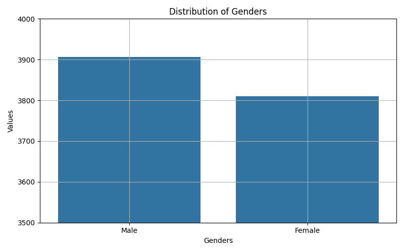
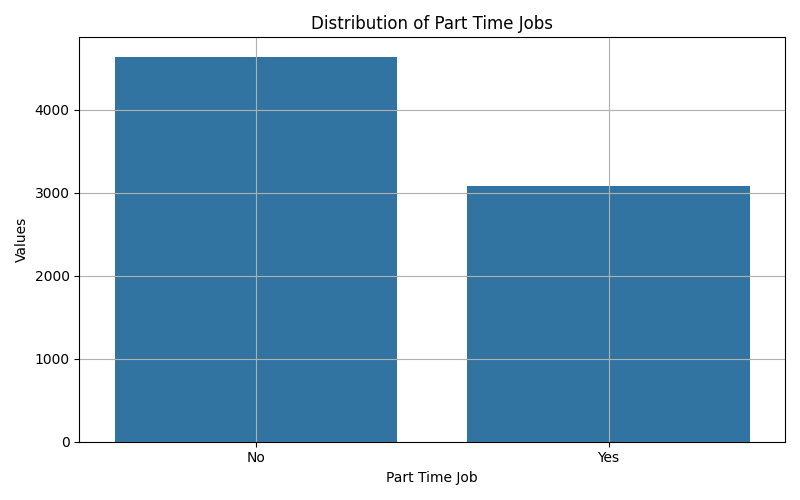
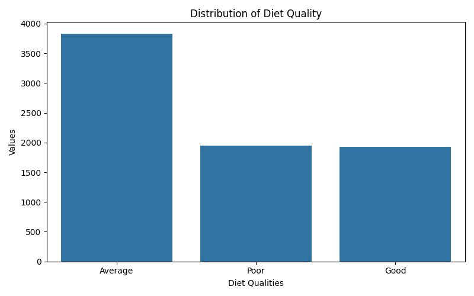
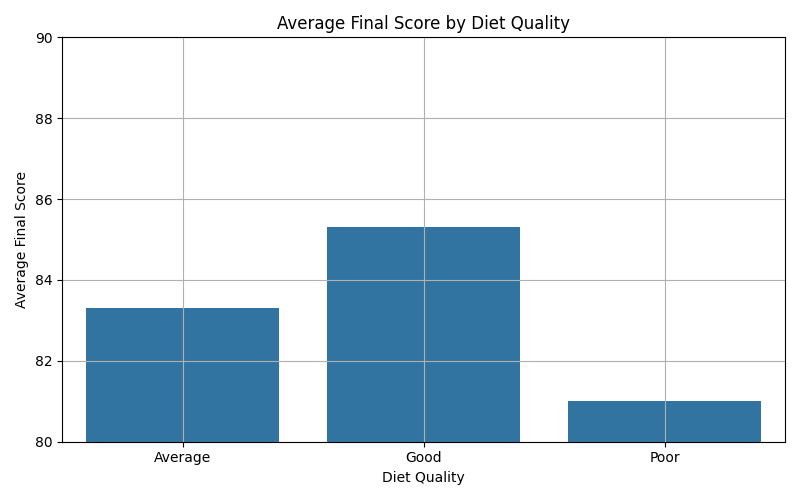
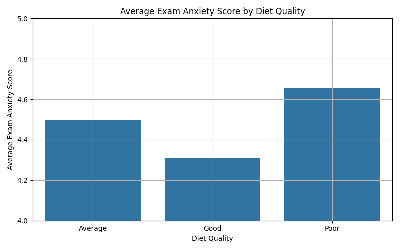
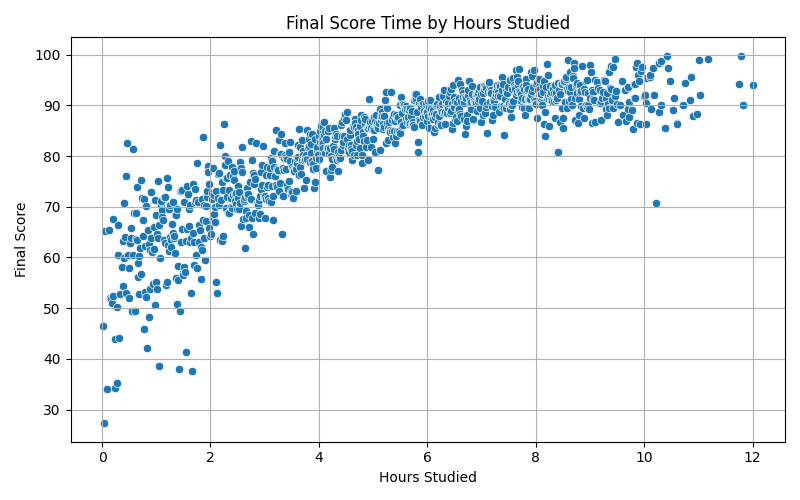
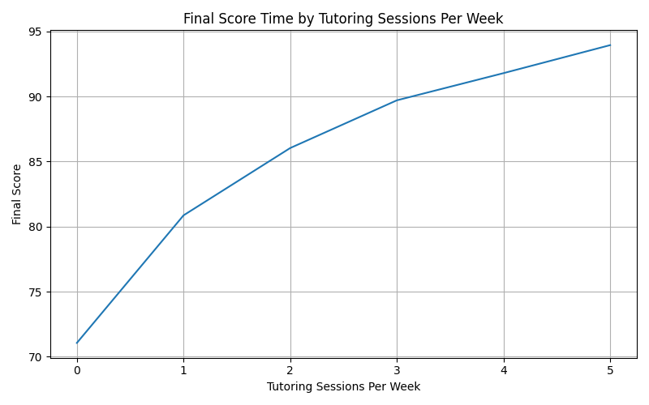
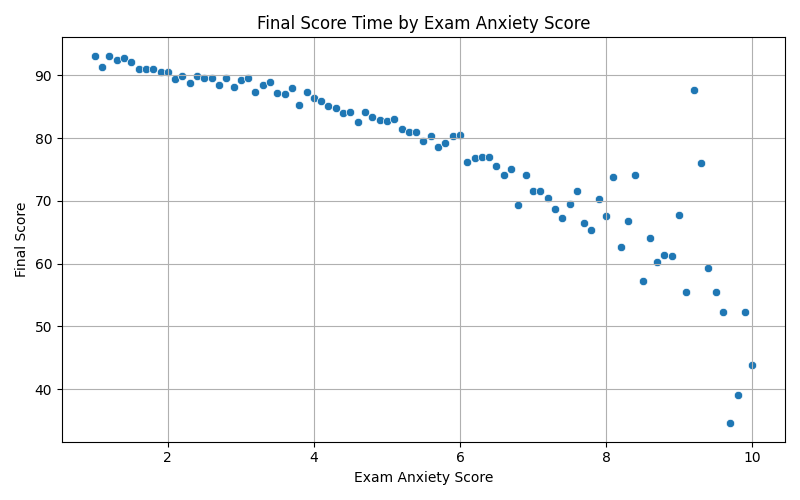
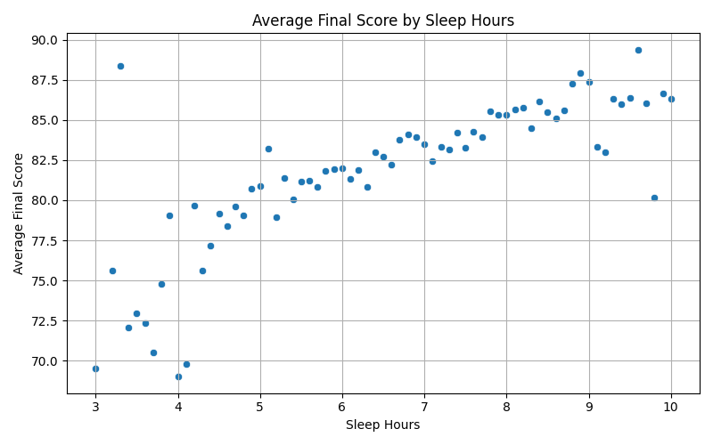
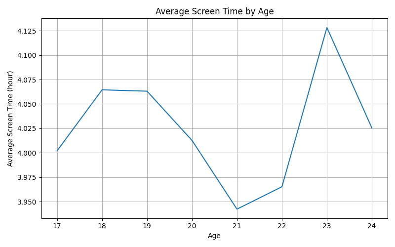

# 📊 Student Performance Analysis

##  Overview

This project presents a comprehensive **Exploratory Data Analysis (EDA)** of a student performance dataset consisting of **8,000 records** and **18 features**. The objective is to identify and interpret the key factors influencing students' academic success, with a particular focus on behavioral, psychological, and lifestyle variables.

The analysis integrates:

- Data cleaning & preprocessing  
- Statistical summarization  
- Correlation analysis  
- Data visualization  
- Insight-driven interpretation  

---

## 📁 Dataset Description

The dataset contains the following categories of features:

###  Academic Factors
- Hours_Studied  
- Attendance  
- Previous_GPA  
- Tutoring_Sessions_Per_Week  

###  Psychological Factors
- Stress_Level  
- Exam_Anxiety_Score  

###  Lifestyle Factors
- Sleep_Hours  
- Diet_Quality  
- Screen_Time  

###  Demographic & Contextual
- Age  
- Gender  
- Family_Income_Level  
- Part_Time_Job  
- Study_Method  

###  Target Variable
- Final_Score  

---

##  Data Preprocessing

- No missing values detected  
- No duplicated records found  
- Non-binary gender category excluded for consistency in comparative analysis  
- Data types verified and standardized  

---

## 📈 Exploratory Data Analysis

###  Correlation Analysis

A correlation matrix was computed to quantify relationships between numerical variables.

### Key Findings:
- Hours Studied ↗ Final Score (0.59) → Strong positive correlation  
- Exam Anxiety ↘ Final Score (-0.49) → Strong negative correlation  
- Tutoring Sessions ↗ Final Score (0.47) → Moderate positive correlation  
- Stress Level ↘ Final Score (-0.29) → Moderate negative correlation  

---

## 📊 Visual Analysis

### 📌 Distribution of Key Variables

  
  
  

---

##  Lifestyle vs Performance

### Diet Quality vs Final Score

**Insight:**  
Students with better diet quality consistently achieve higher final scores.

**Interpretation:**  
Lifestyle factors significantly influence academic performance beyond study effort.

---

### Diet Quality vs Exam Anxiety

**Insight:**  
Improved diet quality is associated with lower exam anxiety.

**Implication:**  
Physical well-being contributes to psychological stability during exams.

---

##  Study Behavior vs Performance

### Hours Studied vs Final Score

**Insight:**  
There is a strong positive relationship between study time and performance.

**Interpretation:**  
Consistent academic effort is a primary driver of success.

---

### Tutoring Sessions vs Final Score

**Insight:**  
Students attending more tutoring sessions tend to achieve higher scores.

---

##  Psychological Factors

### Exam Anxiety vs Final Score

**Insight:**  
Higher exam anxiety significantly reduces academic performance.

**Interpretation:**  
Psychological factors can negatively impact outcomes even with sufficient preparation.

---

##  Sleep & Screen Behavior

### Sleep Hours vs Final Score

**Observation:**  
Moderate positive relationship between sleep and performance.

---

### Age vs Screen Time

---

##  Key Insights (Story-Driven Summary)

###  Main Drivers of Academic Performance

#### Academic Effort
- Hours studied (strongest positive factor)  
- Tutoring sessions  
- Previous GPA  

#### Psychological State
- Exam anxiety (strong negative impact)  
- Stress level  

#### Lifestyle Factors
- Diet quality  
- Sleep patterns  

---

##  Final Conclusion

Academic performance is not determined by a single variable.

It is a **multi-dimensional outcome** influenced by:

- Effort (study habits)  
- Mental state (anxiety & stress)  
- Lifestyle (diet & sleep)  

This highlights the importance of a **holistic approach to student success**.

---

##  Technologies Used

- Python  
- Pandas  
- NumPy  
- Matplotlib  
- Seaborn  

---

## 👩‍💻 Author

**Elif Asya Tanrıvere**  
Computer Engineering Student
